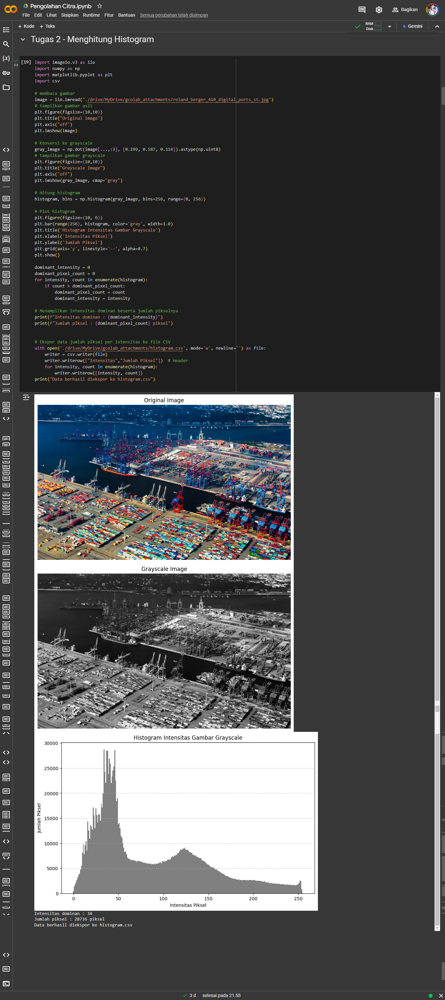

# Tugas 2 Pengolahan Citra

## Pendahuluan

- **Bahasa Pemrograman:** [Python]
- **Tool:** [GoogleColab]

## Implementasi

- **Kode:**
  - Kode program dapat dilihat pada file `main.py` atau pada tautan google colab berikut [Tugas 2 Pengolahan Citra](https://colab.research.google.com/drive/1Pln0v8ZhMfp57R2XpimhG34mV0fmi_SB#scrollTo=s22phyJSim-v&line=3&uniqifier=1).
- **Penjelasan Singkat:**
  - Jumlah total piksel untuk setiap intensitas dapat dilihat pada file histogram.csv
  - Pada percobaan ini, intensitas dominan adalah 34, dengan jumlah piksel yang memiliki intensitas tersebut sebanyak 28,736 piksel. Intensitas ini mendominasi distribusi intensitas dalam gambar, yang mengindikasikan bahwa sebagian besar piksel pada gambar memiliki tingkat kecerahan yang cenderung gelap.

## Hasil

- 

## Author

- Ahmad Sidik Rudini
- 220401020034
